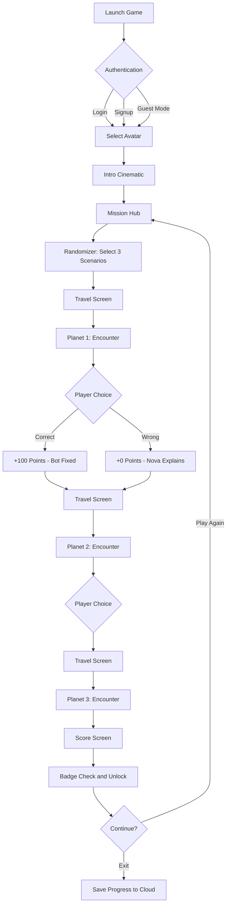

# 🌌 Galactic Glitch Hunters

> **A Narrative Logic-Puzzler where you debug the galaxy's prejudice.**  
> *Project Nova | Built with Godot 4 | Spring 2026*


<!--  -->


---

## � Table of Contents
- [The Premise](#-the-premise)
- [Key Features](#-key-features)
- [Gameplay Mechanics](#-gameplay-mechanics)
- [Scenario Deck](#-scenario-deck-20-scenarios)
- [Technical Stack](#-technical-stack)
- [Installation](#-installation--setup)
- [Team](#-team)
- [Development Timeline](#-development-timeline)
- [License](#-license)

---

## 📜 The Premise

### The Setting
The year is 30XX. Humanity has expanded across the stars, colonizing distant worlds and building a network of interstellar civilizations. The **Galactic Harmony Corps** was established as a peacekeeping force—not to patrol borders or enforce laws, but to maintain something far more fragile: **social harmony**.

### The Crisis
An ancient, dormant computer virus known as **"The Bias"** has mysteriously resurfaced after centuries of dormancy. Unlike traditional malware that corrupts data or crashes systems, The Bias targets something far more insidious: **behavioral logic**.

It infiltrates the neural networks of droids, replicants, and AI systems, rewriting their decision-making code with outdated social algorithms from humanity's troubled past. These infected systems begin enforcing:
- Gender-based role restrictions
- Stereotypical behavior patterns  
- Discriminatory logic trees
- Toxic social norms

The virus doesn't destroy—it **corrupts thinking itself**.

### Your Mission
You are the **newest Cadet** recruited to the Galactic Harmony Corps. Your weapon isn't a laser pistol or plasma cannon—it's **logic, empathy, and critical thinking**.

Accompanied by **Nova**, your hyper-intelligent AI co-pilot (who ironically is often dismissed by the very systems you're trying to fix), you must:
- Travel to infected planets across the galaxy
- Identify glitched bots exhibiting biased behavior
- Deploy **counter-logic** to debug their corrupted code
- Restore fair, empathetic thinking to affected populations

### The Challenge
Every encounter is a **debate, not a battle**. You don't fight enemies; you **fight bad ideas with better ideas**. Choose your words carefully—validating the glitch only makes The Bias stronger. But apply the right logic, and you can free minds from centuries-old prejudice.

**The galaxy's future depends on your ability to recognize bias, challenge stereotypes, and choose empathy over outdated code.**

---

> **Target Audience:** Children aged 8-12  
> **Educational Focus:** Identifying and preventing toxic masculinity, gender stereotypes, and promoting empathy  
> **Supervised by:** Prof. Kavita Vemuri, IIIT Hyderabad

---

## 🎓 Educational Impact

### Why This Game Matters

**Galactic Glitch Hunters** addresses a critical gap in educational gaming: **age-appropriate content that tackles toxic masculinity and gender bias.**

#### The Problem
- Children aged 8-12 are forming core beliefs about gender roles
- Traditional educational methods often feel preachy or boring
- Gaming offers engagement but lacks educational social content

#### Our Solution
- **Gamified Learning:** Complex social issues presented as fun logic puzzles
- **Gender-Neutral Design:** No forced gender selections or stereotypical roles
- **Safe Exploration:** Nova's feedback creates a judgment-free learning environment
- **Cultural Sensitivity:** Multi-language support ensures global accessibility

#### Learning Outcomes
By playing Galactic Glitch Hunters, children will:
- 🧠 Develop critical thinking about social stereotypes
- 💙 Build empathy for diverse identities and experiences
- 🚫 Recognize toxic behaviors and logical fallacies
- ✅ Practice active allyship and inclusive language
- 🌍 Understand identity as fluid and personal

---

## ✨ Key Features

- 🎲 **Dynamic Scenario System** - 20+ unique scenarios, 3 randomly selected per session
- 🌐 **Multi-Language Support** - Pre-built: English, Hindi, Marathi, Telugu, Tamil + AI-powered real-time translation
- 🎭 **Gender-Agnostic Design** - Players choose pronouns (he/him, she/her, they/them) with complementary Nova variants
  - Male & Non-Binary players → Female Nova companion
  - Female players → Male Nova companion
- 🏆 **Badge & Achievement System** - Unlock rewards based on performance and progress
- 💾 **Supabase Backend** - Cloud sync for user progress, scores, and achievements
- 🔐 **Flexible Authentication** - Login, Signup, or Guest Mode
- 📴 **Offline Mode** - Play without internet after initial login
- 🎯 **Educational Impact** - Addresses gender stereotypes, toxic masculinity, identity, and inclusion
- ⚡ **Quick Sessions** - ~10 minutes per playthrough, infinite replayability
- 📱 **Cross-Platform** - Android & Web deployment

---

## 🎮 Gameplay Mechanics

**Galactic Glitch Hunters** is a 10-minute session-based game designed to be replayable.

### Game Flow Architecture



### Core Gameplay Loop 
* **The Deploy:** The game randomly selects **3 Planets** from a "Deck" of 10+ unique scenarios. No two runs are exactly the same.
* **The Glitch:** Upon landing, an NPC blocks your path with a "System Error" (a biased statement).
* **The Choice:** You must select the correct logical counter-argument from 3 options.
* **The Result:**
    * **✅ Debug Success:** The NPC's eyes turn Blue. You earn a **Gold Data Shard** (+100 Pts).
    * **❌ Logic Failure:** The NPC remains corrupted. Nova interrupts the simulation to explain the logical fallacy. (+0 Pts).

### 3. The Scoring System

At the end of each patrol (3 scenarios), you are ranked based on debugging efficiency:

| Score | Rank Title | Badge Earned |
| :---: | :--- | :--- |
| **0-100** | *Glitch Magnet* | Try again! |
| **200** | *System Administrator* | 🥈 Silver Debugger |
| **300** (Perfect) | *Galactic Legend* | 🥇 Master Debugger |

**Scoring Breakdown:**
- ✅ Correct Choice = +100 Points
- ❌ Wrong Choice = +0 Points (Nova explains the error)
- 📈 Cumulative progress tracked across all sessions
- 🏆 Special badges for completing all 10 unique scenarios

---

## 🧩 Scenario Deck (20+ Scenarios)
The game tackles complex social issues by framing them as "System Errors." Each scenario takes place on a **different infected planet**, where you encounter glitched systems exhibiting biased behavior. Your mission: identify the bias and deploy counter-logic to debug it.

### Core Scenarios

| # | Planet/Scenario | The Glitch (Theme) | Educational Focus |
| --- | --- | --- | --- |
| 1 | **Engineering Bay** | Female units are restricted from technical work due to "incompatible programming" | Women in STEM, breaking skill stereotypes |
| 2 | **The Kitchen** | Male units are denied access to culinary systems, labeled as "non-nurturing code" | Challenging toxic masculinity, male emotional expression |
| 3 | **Command Deck** | Female leaders are flagged as "overly assertive" while male leaders are praised | Leadership double standards, "bossy" vs "leader" bias |
| 4 | **Council Chamber** | Female voices are interrupted or ignored in decision-making protocols | Active allyship, respect, amplifying marginalized voices |
| 5 | **The Interview** | Competence is dismissed in favor of appearance-based assessments | Objectification, valuing skills over looks |
| 6 | **Battle Arena** | Emotional expression is classified as "system failure" and suppressed | Toxic masculinity, normalizing vulnerability |
| 7 | **Security Gate** | Binary gender scanners reject non-conforming identities as "errors" | Non-binary inclusion, identity recognition |
| 8 | **The Classroom** | Systems refuse to use singular "they" pronouns, citing "grammar protocols" | Pronoun respect, linguistic evolution |
| 9 | **Uniform Depot** | Clothing/appearance is auto-assigned based on physical scans, not identity | Gender expression freedom, appearance ≠ identity |
| 10 | **ID Station** | Identity updates are rejected as "unstable data" or dismissed as "phases" | Identity validity, growth, self-discovery |

*+ Additional 10+ scenarios in development covering body autonomy, consent, allyship, microaggressions, and inclusive language.*

> **Note:** Each scenario occurs on a unique planet with different environmental contexts, ensuring varied gameplay experiences.

### Randomization System
- Each playthrough randomly selects **3 scenarios** from the pool of 20+
- No duplicate scenarios within a single session
- Players can replay infinitely to experience all scenarios
- Each scenario has **3 choice options**: Correct, Biased, or Passive
- Nova intervenes with educational feedback on incorrect choices

---

## 🛠️ Technical Stack

This project is built using **Godot 4.x** and follows modern game development best practices.

### Core Technologies
* **Game Engine:** Godot 4.x (Compatibility Renderer / OpenGL 3)
* **Primary Language:** GDScript
* **Backend:** Supabase (Authentication + PostgreSQL Database)
* **Translation API:** AI-powered (Gemini/LLM) for real-time language conversion
* **Export Targets:** Android APK, HTML5 (Web)

### Key Plugins & Libraries
* **[Godot Dialogue Manager](https://github.com/nathanhoad/godot_dialogue_manager)** - Branching narrative system
* **Supabase Client** - Cloud database integration
* **HTTP Request Handler** - API communication for translations

### Architecture Patterns
* **Singleton Pattern (`GameState.gd`)** - Global state management (score, progress, settings)
* **Resource-Based Loading** - Scenario deck system for easy content expansion
* **Scene State Machine** - Smooth transitions between game phases
* **Component-Based Design** - Reusable UI elements and game logic

### Database Schema (Supabase)
```sql
users:
  - id (UUID)
  - age (INT)
  - total_score (INT)
  - badges_unlocked (JSONB)
  - preferred_language (VARCHAR)
  - created_at (TIMESTAMP)

user_progress:
  - user_id (UUID)
  - scenarios_completed (JSONB)
  - current_rank (VARCHAR)
  - last_played (TIMESTAMP)
```

---

## 🚀 Installation & Setup

### Prerequisites
* [Godot Engine 4.x](https://godotengine.org/) (Standard Version)
* Git

### Quick Start

#### For Developers:
1.  **Clone the Repository:**
    ```bash
    git clone https://github.com/Ekansh0301/galactic-glitch-hunters.git
    cd galactic-glitch-hunters
    ```

2.  **Install Godot 4.x:**
    - Download from [godotengine.org](https://godotengine.org/)
    - Use the **Standard** version (not .NET)

3.  **Import to Godot:**
    - Open Godot Engine
    - Click `Import`
    - Navigate to the cloned folder and select `project.godot`
    - Wait for initial asset import (first-time only)

4.  **Configure Supabase (Optional for local dev):**
    - Create a `.env` file in the project root
    - Add your Supabase credentials:
      ```
      SUPABASE_URL=your_project_url
      SUPABASE_KEY=your_anon_key
      ```

5.  **Run the Game:**
    - Press `F5` or click the Play button
    - Select the Main Scene if prompted

#### For Players:
- **Android:** Download APK from [Releases](https://github.com/Ekansh0301/galactic-glitch-hunters/releases) (Coming April 2026)
- **Web:** Play directly at [your-game-url.com](#) (Coming April 2026)

---

## 📁 Project Structure
```text
galactic-glitch-hunters/Game/
│
├── 📂 Assets/
│   ├── 🎨 Sprites/
│   │   ├── Nova_Space_Girl_Sprite/   # Female Nova variant
│   │   ├── Nova_male/                # Male Nova variant
│   │   ├── Planets/                  # Planet backgrounds
│   │   └── robotfree/                # Bot/NPC sprites
│   │
│   ├── 🖼️ Backgrounds/
│   │   ├── 1781.jpg                  # Space backgrounds
│   │   ├── 1866.jpg
│   │   ├── 5446991.jpg
│   │   └── digital-art-dark-cosmic-night-sky.jpg
│   │
│   ├── 🌐 Translations/
│   │   ├── galactic_strings.en.po    # English localization
│   │   └── translations.csv.txt      # Translation database
│   │
│   └── 🚀 UI Assets/
│       ├── isolated-rocket-transparent.png
│       └── smoke_07.png              # Particle effects
│
├── 📂 Scenes/
│   ├── MainMenu.tscn                # Entry point
│   ├── login.tscn                   # Authentication
│   ├── Character_Creation.tscn      # Avatar & pronoun selection
│   ├── hub.tscn                     # Mission control center
│   ├── LoadingScreen.tscn           # Travel screen with quotes
│   ├── PlanetView.tscn              # Planet approach view
│   ├── BattleScene.tscn             # Dialogue encounter scene
│   ├── Level.tscn                   # Scenario template 1
│   ├── Level2.tscn                  # Scenario template 2
│   ├── HUD.tscn                     # Score & UI overlay
│   └── GameBalloon.tscn             # Dialogue bubble component
│
├── 📂 Scripts/
│   ├── 🎮 Core/
│   │   ├── GameState.gd             # Global state singleton
│   │   ├── GameManager.gd           # Game loop controller
│   │   └── Hub.gd                   # Hub scene logic
│   │
│   ├── 🔐 Auth/
│   │   ├── AuthManager.gd           # Supabase authentication
│   │   └── Login.gd                 # Login scene logic
│   │
│   ├── 🎭 Gameplay/
│   │   ├── BattleManager.gd         # Scenario/dialogue handler
│   │   ├── level.gd                 # Level 1 controller
│   │   ├── Level2.gd                # Level 2 controller
│   │   └── CharacterCreation.gd     # Avatar/pronoun selection
│   │
│   └── 🖥️ UI/
│       ├── HUD.gd                   # HUD controller
│       ├── LoadingScreen.gd         # Loading screen logic
│       └── PlanetView.gd            # Planet view controller
│
├── 📂 Dialogue/
│   ├── main.dialogue                # Main game dialogue tree
│   └── battle.dialogue              # Scenario-specific dialogues
│
├── 📂 addons/                       # Godot plugins
│   └── dialogue_manager/            # Dialogue Manager plugin
│
├── 📜 project.godot                 # Godot project file
├── 📜 .godot/                       # Godot cache (ignored)
├── 📜 .gitignore
└── 📜 icon.svg                      # Project icon
```

---

## 👥 Team

**Project Nova - Spring 2026**  
*IIIT Hyderabad*

| Name | Student ID | Contributions |
| :--- | :--- | :--- |
| **Ekansh Goyal** | 2023114007 | Core Development, Backend Integration |
| **Aman Uniyal** | 2023113013 | Narrative Design, Scenario Writing |
| **Aman Srivastava** | 2023111001 | UI/UX, Systems Architecture |

---

## 🌍 Localization & Accessibility

### 🌐 Supported Languages
**Pre-built Translations:**
- 🇬🇧 English
- 🇮🇳 Hindi (हिंदी)
- 🇮🇳 Marathi (मराठी)
- 🇮🇳 Telugu (తెలుగు)
- 🇮🇳 Tamil (தமிழ்)

**Real-time AI Translation:**  
Additional languages available via AI-powered translation API for global accessibility.

---

## 🏆 Gamification & Progression

### 🏅 Badge System
Unlock achievements as you progress:
- 🥉 **Glitch Novice** - Complete your first session
- 🥈 **Logic Defender** - Score 200+ in a single run
- 🥇 **Galactic Legend** - Perfect score (300) achieved
- 🌟 **Master Debugger** - Complete all 20+ scenarios
- 💎 **Nova's Ally** - Always choose respectful dialogue options

### 🎮 Features
- ♾️ **Infinite Replayability** - Play unlimited sessions (3 random scenarios each)
- 📴 **Offline Mode** - Progress saved locally when offline
- ☁️ **Cloud Sync** - Automatic progress backup via Supabase
- 📊 **Progress Tracking** - Track scenarios completed, best scores, and unlocked badges

---

## 📅 Development Timeline

**Project Duration:** January 2026 - April 2026  
**Submission Deadline:** April 1st Week, 2026

| Phase | Timeline | Key Deliverables | Status |
| --- | --- | --- | --- |
| **Phase 1: Planning** | Jan 2026 | Game Design Document, Scenario Writing, Technical Specification | Complete |
| **Phase 2: Core Dev** | Feb 2026 | Scene architecture, Dialogue system, Randomizer logic | In Progress |
| **Phase 3: Backend** | Mid Feb - Early Mar 2026 | Supabase integration, Authentication, Cloud sync | Planned |
| **Phase 4: Content** | Mar 2026 | All 20+ scenarios implemented, Translation system | Planned |
| **Phase 5: Polish** | Late Mar 2026 | UI/UX refinement, Bug fixes, Internal testing | Planned |
| **Phase 6: Deployment** | Week 1, April 2026 | Android APK build, Web deployment, Final submission | Planned |

---

## 💡 Loading Screen Quotes

Between planets, players see educational quotes from Nova:

> "Identity is an Operating System, not a glitch. It can update and evolve." ~ Nova

> "Logic is the ultimate weapon against bias." ~ Nova

> "When someone tells you who they are, believe them the first time." ~ Nova

> "Updating outdated protocols isn't weakness—it's evolution." ~ Nova

> "The strongest code adapts to new information." ~ Nova

---

## 🚀 Quick Links

- [Game Design Document](#) (Internal)
- [Report a Bug](https://github.com/Ekansh0301/galactic-glitch-hunters/issues/new?labels=bug)
- [Feature Request](https://github.com/Ekansh0301/galactic-glitch-hunters/issues/new?labels=enhancement)
- [Wiki & Documentation](#) (Coming Soon)

---

## 🎯 Project Objectives

### ✅ Core Requirements
- ✓ **Quick Sessions** - 10-minute gameplay per run
- ✓ **Android Deployment** - Fully deployable on Android devices
- ✓ **Diverse Scenarios** - 20+ unique story scenarios covering toxic behaviors
- ✓ **Multi-Language** - Language-agnostic architecture with easy language switching

### 🎯 Educational Goals
- ✓ Address toxic masculinity in age-appropriate manner
- ✓ Challenge gender stereotypes and roles
- ✓ Promote inclusion and respect for diverse identities
- ✓ Develop empathy and critical thinking skills
- ✓ Teach logical reasoning through narrative choices

---

## 🔧 Build Information

### System Requirements

**For Development:**
- Godot 4.x or higher
- Windows 10/11, macOS 10.13+, or Linux
- 4GB RAM minimum (8GB recommended)
- 500MB free disk space

**For Players (Android):**
- Android 5.0 (Lollipop) or higher
- 100MB free storage
- Internet connection (first login only)

**For Players (Web):**
- Modern browser (Chrome, Firefox, Edge, Safari)
- JavaScript enabled
- 50MB available for cache

### Export Notes
- **Android:** Uses Godot Export Template for Android
- **Web:** HTML5 export with WASM support
- **Offline Assets:** Cached locally after first download

---

## 📊 Development Status

Current Phase: **Core Development (Phase 2)**

**Repository:** [github.com/Ekansh0301/galactic-glitch-hunters](https://github.com/Ekansh0301/galactic-glitch-hunters)

**Recently Completed:**
- Complete Game Design Document
- Scenario writing (20+ scenarios planned, 10 finalized)
- Technical architecture planning
- Repository setup

**In Progress:**
- Scene architecture setup
- Dialogue system implementation
- Scenario randomizer logic

**Coming Next:**
- Supabase backend integration
- Authentication flow
- First playable prototype

---

## 🤝 Contributing

This is an academic project for Spring 2026. External contributions are not currently accepted, but feedback and suggestions are welcome!

**For Issues/Suggestions:**
- Open an issue on GitHub
- Tag with appropriate labels (bug, enhancement, question)

---

## 📜 License

This project is licensed under the **MIT License** - see the [LICENSE](LICENSE) file for details.

### Third-Party Assets
- Game assets from **Kenney.nl** (CC0 License)
- Godot Engine (MIT License)

---

## 🙏 Acknowledgments

* **Godot Community** - For the incredible open-source game engine
* **Kenney.nl** - For high-quality, free game assets
* **Educational Psychology Research** - Informing our approach to the 8-12 age demographic
* **Our Professor** - For guidance and project opportunity
* **Open Source Community** - For tools like Supabase and Godot plugins

---

## 📞 Contact

For inquiries about this project:
- 📧 **Email:** [ekansh.goyal@research.iiit.ac.in](mailto:ekansh.goyal@research.iiit.ac.in)
- 🐙 **GitHub Issues:** [Open an Issue](https://github.com/Ekansh0301/galactic-glitch-hunters/issues)
- 📚 **Institution:** IIIT Hyderabad

---

<div align="center">

## Support the Project

If you find this project interesting or educational, consider giving it a star!

[](https://github.com/Ekansh0301/galactic-glitch-hunters/stargazers)
[](https://github.com/Ekansh0301/galactic-glitch-hunters/network/members)
[](https://github.com/Ekansh0301/galactic-glitch-hunters/watchers)

---

### "Logic is the ultimate weapon against bias." - Nova

*Built by Team Project Nova*

**Fighting outdated logic, one planet at a time.**

---


**Spring 2026 | IIIT Hyderabad**

[⬆ Back to Top](#-galactic-glitch-hunters)

</div>
